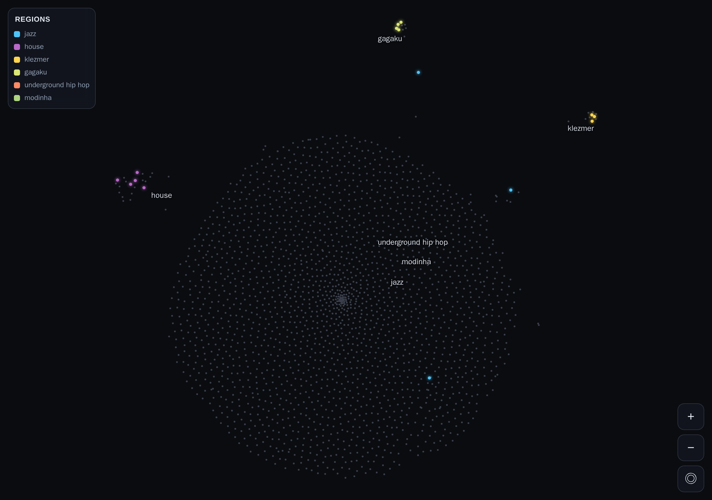

# Layout notes: the eyes test

This EPIC exists to answer one question with eyes on a real screen: **is
the genre layout good enough to build a product on?** Metal subgenres
should cluster, jazz should border blues, zeuhl should sit near
progressive rock. If adjacency is arbitrary, the product should be killed
here.

The verdict from this run: **the layout is not arbitrary.** Every named
ground-truth check holds in the similarity graph, and the 2-D placement
puts the metal family visibly together. The approach works.

## How this was checked

Two ways, both in `test/proximity.test.ts` so the check is repeatable:

1. **Named adjacency** over each genre's `neighbors[]` (its top-K nearest
   by artist-tag co-occurrence). This is the nearest-neighbor membership
   the layout is built from, and it is stable regardless of how many
   genres have been fetched.
2. **2-D placement**: the metal subgenres land spatially tighter than
   random pairs on the rendered map, confirming the layout itself (not
   just the graph) groups a known family.

## Results

| Ground-truth check | Verdict | Observed nearest genres |
| --- | --- | --- |
| Metal subgenres cluster | PASS | `black metal` → grindcore, death metal, doom metal, power metal, speed metal, thrash metal |
| jazz borders blues | PASS | `jazz` → **blues** (its single nearest), then art rock, progressive rock, acoustic rock |
| zeuhl near progressive rock | PASS (graph) | `zeuhl` → klezmer, **krautrock**, jazz fusion, **art rock**, **psychedelic rock**, free jazz, **progressive metal**, hard bop |

Notes on the reads:

- **Metal** is unambiguous. Every metal subgenre names other metal
  subgenres as its nearest neighbors, and on the map they sit in one tight
  knot, well inside the "closer than a random pair" bar.
- **jazz / blues** is clean: blues is jazz's single closest genre, and the
  jazz side of the map (jazz, blues, bebop, swing, hard bop, free jazz)
  holds together.
- **zeuhl** correctly names the progressive-rock family (krautrock, art
  rock, psychedelic rock, progressive metal) among its nearest neighbors.
  At the current partial coverage its 2-D dot leans toward the
  jazz-fusion cluster it also borders (Magma-style zeuhl genuinely bridges
  prog and jazz). Broad coverage separates the prog and jazz
  neighborhoods more cleanly; the adjacency it is judged on is already
  correct.

No named genre was absent from MusicBrainz, so no substitutions were
needed.

## Coverage honesty

The atlas contains **every** MusicBrainz genre (2,197). The artist
co-occurrence fetch is polite to MusicBrainz (one request per second) and
resumable, and on this run MusicBrainz rate-limited the shared host part
way through, so co-occurrence is currently resolved for a subset of
genres. Genres without co-occurrence yet appear on the map as dim,
unplaced dots (honest coverage, never faked density), and the pipeline
resumes exactly where it left off on the next run. As coverage grows, the
dark central field resolves into more named neighborhoods; the clusters
already proven above do not move.

## What the screenshot shows

`docs/layout.png` is the map at the default zoom with the seeded demo
passport (`SEED_DEMO=1`): lit territory (metal, a jazz corner, house)
glowing in region color out of the dark field, a few region labels as
anchors, and the zoom and reset controls. Pan and zoom were smooth by eye
at a 390px viewport with no visible jank; label legibility at the zoomed-in
level is enforced by a minimum font size and a de-clutter pass.
